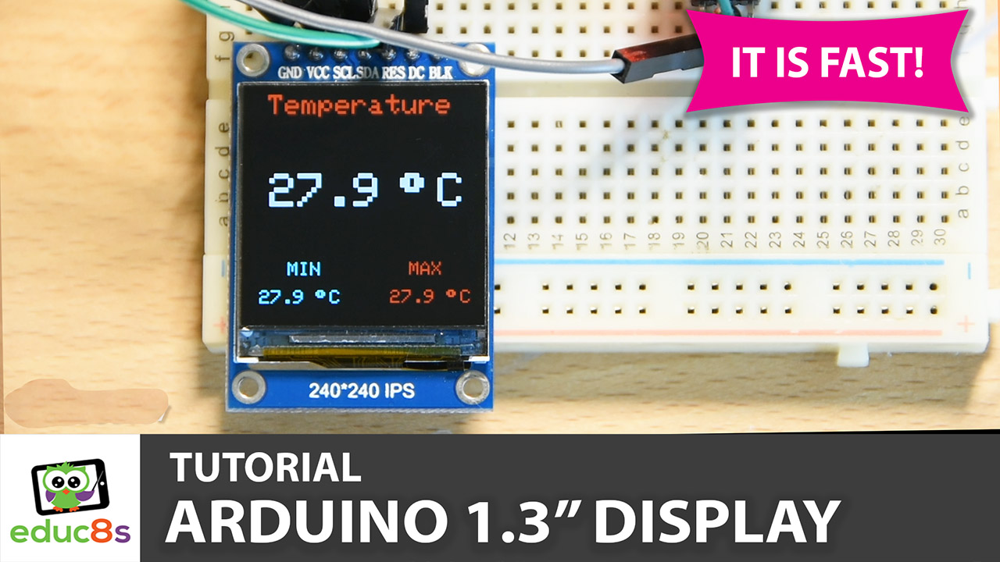
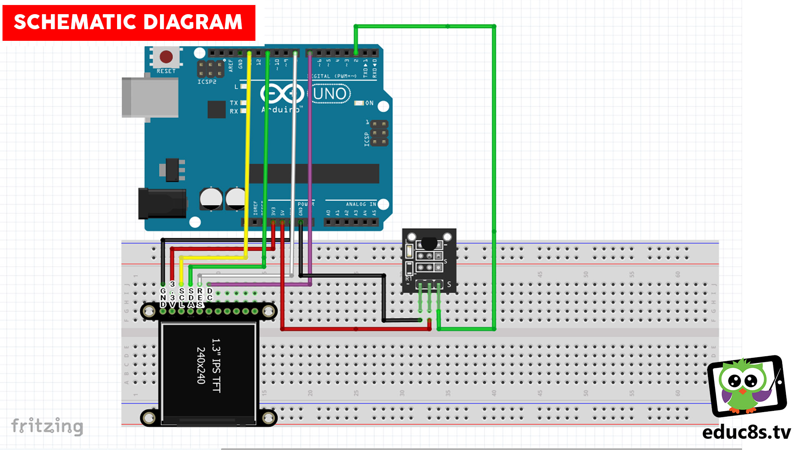

# Arduino-ST7789-Temperature

This is a simple Thermometer using the DS18B20 temperature sensor and an ST7789 display on Arduino.

  

🎥 [Watch the video on YouTube](https://www.youtube.com/watch?v=-nECx4DOE84)

 
 

| 📺 <a href="https://www.youtube.com/educ8s">YouTube Channel</a>
| 🌍 <a href="http://www.educ8s.tv">Website</a> |  

# Parts Needed
🛒 Arduino Uno: http://educ8s.tv/part/ArduinoUno

🛒 ST7789 Display: http://educ8s.tv/part/st7789

🛒 DS18B20 Temperature Sensor: http://educ8s.tv/part/DS18B20

🛒 Breadboard: http://educ8s.tv/part/SmallBreadboard

🛒 Wires: http://educ8s.tv/part/Wires

💖 Full disclosure: All of the links above are affiliate links. I get a small percentage of each sale they generate. Thank you for your support!

# Schematic Diagram

  

# Credits & Thanks

  - Kudos to [cbm80amiga](https://github.com/cbm80amiga) for being the creator of the original ST7789 fast library without which this project would not exist.

